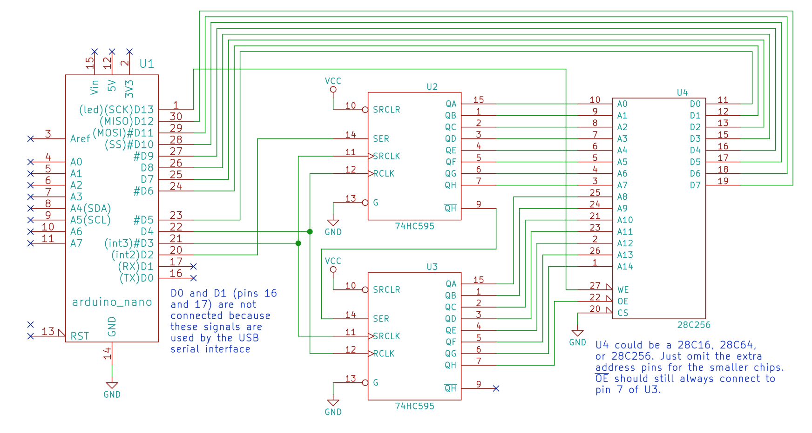

# Personal Website

## EEPROM Schematic

## Project Overview

I developed a ROM assembly compiler that bridges the gap between high-level assembly programming and the custom opcode architecture of my 8-bit breadboard computer. This compiler translates my own RISC-style assembly language into machine-readable opcodes and writes the compiled data directly to an EEPROM using an Arduino Uno.

The project simplifies program creation for my computer by automating opcode generation and EEPROM programming. It highlights my skills in designing program compilation, integrating hardware, and understanding low-level computing concepts.

## How to run

### Set Up Hardware
Refer to the Physical Connections Diagram above for wiring.

### Modify Assembly Code

Open the .ino file in Arduino IDE.
Replace the program[] array with your desired assembly instructions in opcode format.

### Upload Code

Select the correct board and port in Arduino IDE.
Click Upload to flash the Arduino.

### Program EEPROM

Open the Serial Monitor at 57600 baud.
The program will write your assembly code to the EEPROM and verify the contents.